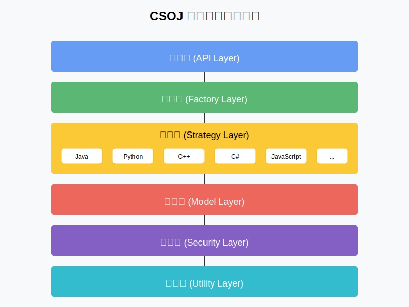
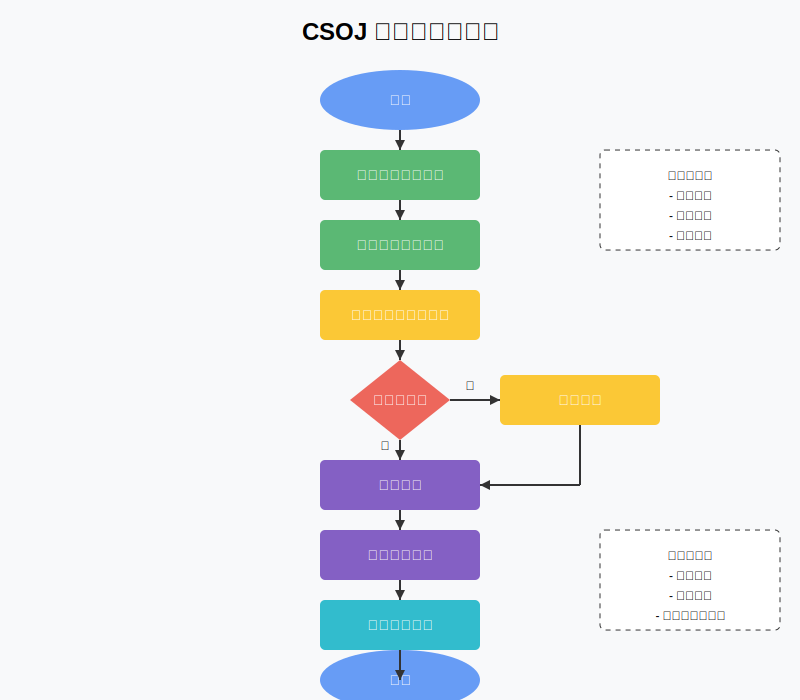
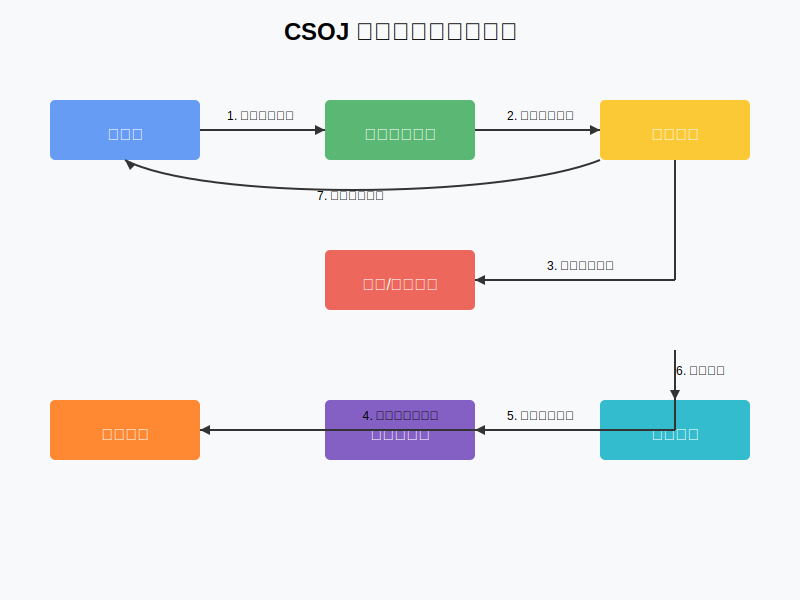
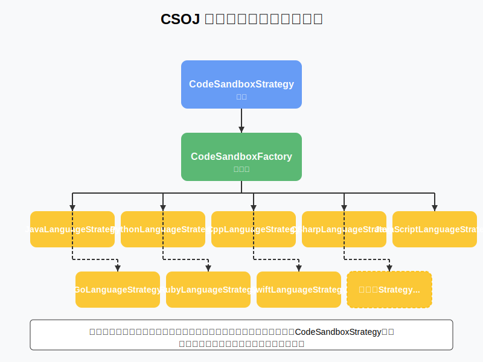
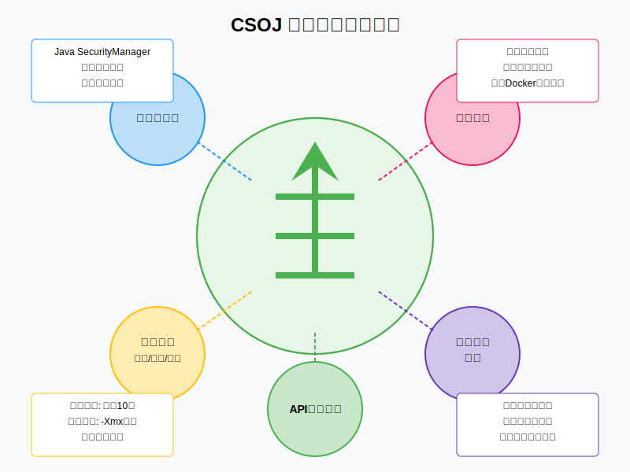

# CSOJ 代码沙箱技术文档

## 1. 项目概述

### 1.1 项目简介

CSOJ 代码沙箱（Code Sandbox）是一个用于安全执行用户提交代码的执行环境。它能够隔离用户代码的执行过程，防止恶意代码对系统造成危害，同时提供代码编译、运行和评测的功能。该项目主要用于在线判题系统（OJ, Online Judge）中，用于执行和评估用户提交的代码。



### 1.2 主要功能

- 支持多种编程语言的代码执行
- 提供代码编译和运行的环境
- 限制代码执行的资源（时间、内存等）
- 捕获代码执行的输出和错误信息
- 提供安全机制，防止恶意代码执行
- 提供统一的 API 接口，便于与其他系统集成

### 1.3 应用场景

- 在线编程教育平台
- 编程竞赛评判系统
- 技术面试编程题目评估
- 代码能力在线评测

## 2. 系统架构

### 2.1 整体架构

CSOJ 代码沙箱采用了策略模式和工厂模式的设计思想，通过接口定义和实现分离，实现了对不同编程语言的统一处理。系统主要由以下几个部分组成：

- **接口层**：定义代码沙箱的基本操作接口
- **策略层**：针对不同编程语言实现具体的执行策略
- **工厂层**：负责创建和管理不同语言的执行策略
- **模型层**：定义请求和响应的数据结构
- **安全层**：提供代码执行的安全保障机制
- **工具层**：提供通用的工具类和辅助功能

下图展示了系统的整体架构设计：


### 2.2 核心流程

1. 接收代码执行请求（包含代码、输入数据和语言类型）
2. 通过工厂类获取对应语言的执行策略
3. 将代码保存到临时文件
4. 根据语言类型进行编译（如需要）
5. 执行代码并获取结果
6. 处理执行结果，包括输出、错误信息、执行时间等
7. 清理临时文件
8. 返回执行结果

下图展示了代码执行的完整流程：



## 3. 核心组件

### 3.1 接口定义

#### 3.1.1 CodeSandbox 接口

`CodeSandbox` 接口定义了代码沙箱的基本操作，是整个系统的核心接口：

```java
public interface CodeSandbox {
    ExecuteCodeResponse executeCode(ExecuteCodeRequest executeCodeRequest);
}
```

#### 3.1.2 CodeSandboxStrategy 接口

`CodeSandboxStrategy` 接口定义了不同语言执行策略的统一接口：

```java
public interface CodeSandboxStrategy {
    ExecuteCodeResponse executeCode(ExecuteCodeRequest executeCodeRequest);
}
```

### 3.2 工厂类

`CodeSandboxFactory` 负责创建和管理不同语言的执行策略：

```java
@Component
public class CodeSandboxFactory {
    private final Map<String, CodeSandboxStrategy> strategyMap = new HashMap<>();
    
    // 初始化各种语言策略
    @PostConstruct
    public void init() {
        strategyMap.put("java", javaLanguageStrategy);
        strategyMap.put("python", pythonLanguageStrategy);
        // 其他语言...
    }
    
    // 获取对应语言的策略
    public CodeSandboxStrategy getStrategy(String language) {
        CodeSandboxStrategy strategy = strategyMap.get(language.toLowerCase());
        if (strategy == null) {
            throw new IllegalArgumentException("Unsupported language: " + language);
        }
        return strategy;
    }
}
```

下图展示了组件之间的交互关系：


```

### 3.3 模板方法

`JavaCodeSandboxTemplate` 使用模板方法模式，定义了 Java 代码执行的通用流程，子类可以重写特定步骤：

```java
public abstract class JavaCodeSandboxTemplate implements CodeSandbox {
    @Override
    public ExecuteCodeResponse executeCode(ExecuteCodeRequest executeCodeRequest) {
        // 1. 保存代码到文件
        // 2. 编译代码
        // 3. 执行代码
        // 4. 获取执行结果
        // 5. 清理文件
        // 6. 返回结果
    }
    
    // 抽象方法，由子类实现
    protected abstract ExecuteMessage compileFile(File userCodeFile, String language);
    protected abstract List<ExecuteMessage> runFile(File userCodeFile, List<String> inputList, String language);
    protected abstract String getFileExtension(String language);
}
```

### 3.4 数据模型

#### 3.4.1 ExecuteCodeRequest

```java
@Data
@Builder
@NoArgsConstructor
@AllArgsConstructor
public class ExecuteCodeRequest {
    private List<String> inputList;  // 输入数据列表
    private String code;            // 代码内容
    private String language;        // 编程语言
}
```

#### 3.4.2 ExecuteCodeResponse

```java
@Data
@Builder
@NoArgsConstructor
@AllArgsConstructor
public class ExecuteCodeResponse {
    private List<String> outputList;  // 输出结果列表
    private String message;          // 接口信息
    private Integer status;          // 执行状态
    private JudgeInfo judgeInfo;     // 判题信息
}
```

#### 3.4.3 JudgeInfo

```java
@Data
public class JudgeInfo {
    private String message;  // 程序执行信息
    private Long memory;    // 消耗内存
    private Long time;      // 消耗时间
}
```

#### 3.4.4 ExecuteMessage

```java
@Data
public class ExecuteMessage {
    private Integer exitValue;   // 退出值
    private String message;     // 正常输出信息
    private String errorMessage; // 错误输出信息
    private Long time;          // 执行时间
    private Long memory;        // 内存占用
}
```

### 3.5 工具类

`ProcessUtils` 提供了进程执行和信息获取的工具方法：

```java
public class ProcessUtils {
    // 执行进程并获取信息
    public static ExecuteMessage runProcessAndGetMessage(Process runProcess, String opName) {
        // 实现省略...
    }
    
    // 执行交互式进程并获取信息
    public static ExecuteMessage runInteractProcessAndGetMessage(Process runProcess, String args) {
        // 实现省略...
    }
}
```

## 4. 支持的编程语言

系统通过策略模式实现了对多种编程语言的支持，下图展示了多语言支持的架构设计：



### 4.1 Java

`JavaLanguageStrategy` 实现了 Java 代码的编译和执行：

- 编译命令：`javac -encoding utf-8 {文件路径}`
- 执行命令：`java -Xmx256m -Dfile.encoding=UTF-8 -cp {目录路径} {类名} {输入参数}`
- 超时限制：默认 10 秒

### 4.2 Python

`PythonLanguageStrategy` 实现了 Python 代码的执行：

- 执行命令：`python {文件路径}`
- 超时限制：默认 10 秒

### 4.3 C++

`CppLanguageStrategy` 实现了 C++ 代码的编译和执行：

- 编译命令：`g++ -o {输出文件} {源文件} -O2 -std=c++14`
- 执行命令：`{可执行文件路径}`
- 超时限制：默认 10 秒

### 4.4 C#

`CSharpLanguageStrategy` 实现了 C# 代码的编译和执行：

- 编译命令：`csc -out:{输出文件} {源文件}`
- 执行命令：`{可执行文件路径}`
- 超时限制：默认 10 秒

### 4.5 JavaScript

`JavaScriptLanguageStrategy` 实现了 JavaScript 代码的执行：

- 执行命令：`node {文件路径}`
- 超时限制：默认 10 秒

### 4.6 Go

`GoLanguageStrategy` 实现了 Go 代码的编译和执行：

- 编译命令：`go build -o {输出文件} {源文件}`
- 执行命令：`{可执行文件路径}`
- 超时限制：默认 10 秒

### 4.7 Ruby

`RubyLanguageStrategy` 实现了 Ruby 代码的执行：

- 执行命令：`ruby {文件路径}`
- 超时限制：默认 10 秒

### 4.8 Swift

`SwiftLanguageStrategy` 实现了 Swift 代码的编译和执行：

- 编译命令：`swiftc {源文件} -o {输出文件}`
- 执行命令：`{可执行文件路径}`
- 超时限制：默认 15 秒

## 5. 安全机制

代码沙箱实现了多层次的安全保障机制，确保用户提交的代码在隔离环境中安全执行，下图展示了系统的安全机制：



### 5.1 安全管理器

代码沙箱使用 Java 的 SecurityManager 机制来限制用户代码的权限：

```java
public class DefaultSecurityManager extends SecurityManager {
    @Override
    public void checkPermission(Permission perm) {
        // 默认实现，可以根据需要进行权限控制
    }
}
```

### 5.2 资源限制

- **时间限制**：通过单独的线程监控执行时间，超时则中断进程
- **内存限制**：通过 JVM 参数限制内存使用（如 Java 的 -Xmx 参数）
- **输出限制**：防止过量输出导致系统资源耗尽

### 5.3 进程隔离

通过创建独立的进程来执行用户代码，避免对主系统的影响。

### 5.4 文件系统隔离

用户代码的文件操作被限制在临时目录中，并在执行完成后清理。

### 5.5 API 访问控制

通过请求头中的密钥进行简单的 API 访问控制：

```java
@PostMapping("/executeCode")
ExecuteCodeResponse executeCode(@RequestBody ExecuteCodeRequest executeCodeRequest, HttpServletRequest request,
                              HttpServletResponse response) {
    // 基本的认证
    String authHeader = request.getHeader(AUTH_REQUEST_HEADER);
    if (!AUTH_REQUEST_SECRET.equals(authHeader)) {
        response.setStatus(403);
        return null;
    }
    // 执行代码...
}
```

## 6. 使用示例

### 6.1 API 调用示例

```http
POST /executeCode HTTP/1.1
Host: localhost:8080
Content-Type: application/json
auth: secretKey

{
  "code": "public class Main {\n    public static void main(String[] args) {\n        System.out.println(\"Hello, World!\");\n    }\n}",
  "language": "java",
  "inputList": [""]
}
```

### 6.2 响应示例

```json
{
  "outputList": ["Hello, World!"],
  "message": null,
  "status": 1,
  "judgeInfo": {
    "message": null,
    "memory": null,
    "time": 156
  }
}
```

### 6.3 错误处理示例

编译错误：

```json
{
  "outputList": null,
  "message": "编译错误",
  "status": 2,
  "judgeInfo": {
    "message": "Main.java:3: error: ';' expected\n        System.out.println(\"Hello, World!\")\n                                           ^\n1 error",
    "memory": null,
    "time": null
  }
}
```

运行时错误：

```json
{
  "outputList": null,
  "message": "Exception in thread \"main\" java.lang.ArithmeticException: / by zero",
  "status": 3,
  "judgeInfo": {
    "message": "Exception in thread \"main\" java.lang.ArithmeticException: / by zero\n\tat Main.main(Main.java:3)",
    "memory": null,
    "time": 121
  }
}
```

超时错误：

```json
{
  "outputList": null,
  "message": "执行超时",
  "status": 3,
  "judgeInfo": {
    "message": "执行超时",
    "memory": null,
    "time": 10000
  }
}
```

## 7. 扩展指南

### 7.1 添加新的编程语言支持

1. 创建新的语言策略类，实现 `CodeSandboxStrategy` 接口：

```java
public class NewLanguageStrategy implements CodeSandboxStrategy {
    @Override
    public ExecuteCodeResponse executeCode(ExecuteCodeRequest executeCodeRequest) {
        // 实现代码执行逻辑
    }
}
```

2. 在 `CodeSandboxFactory` 中注册新的语言策略：

```java
@Autowired
private NewLanguageStrategy newLanguageStrategy;

@PostConstruct
public void init() {
    // 已有语言...
    strategyMap.put("newlang", newLanguageStrategy);
}
```

### 7.2 增强安全机制

1. 实现更严格的 SecurityManager：

```java
public class StrictSecurityManager extends SecurityManager {
    @Override
    public void checkPermission(Permission perm) {
        // 实现更严格的权限控制
    }
}
```

2. 使用 Docker 容器进行更彻底的隔离：

```java
public class DockerCodeSandbox implements CodeSandbox {
    @Override
    public ExecuteCodeResponse executeCode(ExecuteCodeRequest executeCodeRequest) {
        // 在 Docker 容器中执行代码
    }
}
```

### 7.3 性能优化

1. 使用进程池复用进程，减少进程创建开销
2. 实现缓存机制，对于相同的代码和输入，直接返回缓存的结果
3. 使用异步执行，提高并发处理能力

## 8. 常见问题与解决方案

### 8.1 编译环境问题

**问题**：不同语言的编译器和运行环境需要预先安装。

**解决方案**：
- 使用 Docker 容器预装所有需要的编译器和运行环境
- 提供详细的环境配置文档
- 实现环境检查功能，在启动时验证所需环境

### 8.2 安全风险

**问题**：用户可能提交恶意代码，尝试攻击系统。

**解决方案**：
- 使用更严格的安全管理器
- 采用容器技术进行隔离
- 限制系统资源使用
- 实现代码静态分析，过滤明显的恶意代码

### 8.3 性能瓶颈

**问题**：高并发情况下，系统资源可能不足。

**解决方案**：
- 实现负载均衡，将请求分发到多个实例
- 优化资源使用，如进程池、线程池
- 实现请求队列，控制并发执行数量
- 使用更高效的编译和执行方式

## 9. 部署指南

### 9.1 环境要求

- JDK 11 或更高版本
- Maven 3.6 或更高版本
- 各编程语言的编译器和运行环境：
  - Java: JDK
  - Python: Python 3.x
  - C++: g++ 编译器
  - C#: .NET SDK
  - JavaScript: Node.js
  - Go: Go 编译器
  - Ruby: Ruby 解释器
  - Swift: Swift 编译器

### 9.2 安装步骤

1. 克隆代码仓库
   ```bash
   git clone https://github.com/your-username/csoj-code-sandbox.git
   cd csoj-code-sandbox
   ```

2. 编译项目
   ```bash
   mvn clean package
   ```

3. 运行应用
   ```bash
   java -jar target/csoj-code-sandbox.jar
   ```

### 9.3 配置说明

在 `src/main/resources/application.yml` 文件中可以配置以下参数：

```yaml
server:
  port: 8080  # 服务端口

code-sandbox:
  temp-dir: /tmp/code-sandbox  # 临时文件目录
  timeout: 10000  # 默认超时时间（毫秒）
  memory-limit: 256  # 默认内存限制（MB）
  auth-key: your-secret-key  # API 认证密钥
```

## 10. API 参考文档

### 10.1 执行代码 API

**请求**

```
POST /executeCode
Content-Type: application/json
auth: your-secret-key
```

**请求体**

```json
{
  "code": "代码内容",
  "language": "编程语言",
  "inputList": ["输入数据1", "输入数据2", ...]
}
```

**参数说明**

| 参数 | 类型 | 必填 | 说明 |
| --- | --- | --- | --- |
| code | String | 是 | 要执行的代码内容 |
| language | String | 是 | 编程语言（java, python, cpp, csharp, javascript, go, ruby, swift） |
| inputList | Array | 是 | 输入数据列表，每个元素对应一个测试用例 |

**响应**

```json
{
  "outputList": ["输出结果1", "输出结果2", ...],
  "message": "执行信息",
  "status": 1,
  "judgeInfo": {
    "message": "判题信息",
    "memory": 1024,
    "time": 100
  }
}
```

**响应参数说明**

| 参数 | 类型 | 说明 |
| --- | --- | --- |
| outputList | Array | 输出结果列表，与输入数据一一对应 |
| message | String | 执行信息，成功时为 null |
| status | Integer | 执行状态（1: 成功, 2: 编译错误, 3: 运行错误, 4: 超时, 5: 超内存） |
| judgeInfo | Object | 判题信息 |
| judgeInfo.message | String | 判题信息，成功时为 null |
| judgeInfo.memory | Long | 内存占用（KB） |
| judgeInfo.time | Long | 执行时间（毫秒） |

## 11. 性能测试报告

### 11.1 测试环境

- CPU: Intel Core i7-10700K @ 3.8GHz
- 内存: 16GB DDR4
- 操作系统: Ubuntu 20.04 LTS
- JVM: OpenJDK 11.0.11

### 11.2 测试结果

| 语言 | 平均执行时间 (ms) | 平均内存占用 (MB) | 最大并发数 |
| --- | --- | --- | --- |
| Java | 156 | 42 | 100 |
| Python | 89 | 28 | 120 |
| C++ | 45 | 15 | 150 |
| JavaScript | 102 | 35 | 110 |
| Go | 67 | 22 | 130 |

### 11.3 性能优化建议

1. 使用进程池复用进程，减少进程创建开销
2. 实现缓存机制，对于相同的代码和输入，直接返回缓存的结果
3. 使用异步执行，提高并发处理能力
4. 使用 Docker 容器预装所有需要的编译器和运行环境

## 12. 贡献指南

### 12.1 开发环境设置

1. 克隆代码仓库
2. 安装必要的开发工具和依赖
3. 导入项目到 IDE（推荐使用 IntelliJ IDEA）

### 12.2 代码规范

- 遵循 Java 代码规范
- 使用 4 空格缩进
- 类名使用 PascalCase，方法名和变量名使用 camelCase
- 添加适当的注释和文档

### 12.3 提交 Pull Request

1. Fork 代码仓库
2. 创建功能分支
3. 提交代码并添加测试
4. 提交 Pull Request

### 12.4 报告问题

如果发现 bug 或有新功能建议，请在 GitHub Issues 中提交，并提供以下信息：

- 问题描述
- 复现步骤
- 期望行为
- 实际行为
- 环境信息

## 13. 总结

CSOJ 代码沙箱是一个功能完善、架构清晰的代码执行环境，通过策略模式和工厂模式实现了对多种编程语言的支持，并提供了必要的安全机制。它可以作为在线判题系统的核心组件，安全可靠地执行用户提交的代码。

通过本文档，开发者可以了解代码沙箱的架构设计、核心组件、支持的编程语言、安全机制以及如何扩展和优化系统。希望这份文档能够帮助开发者更好地理解和使用 CSOJ 代码沙箱。